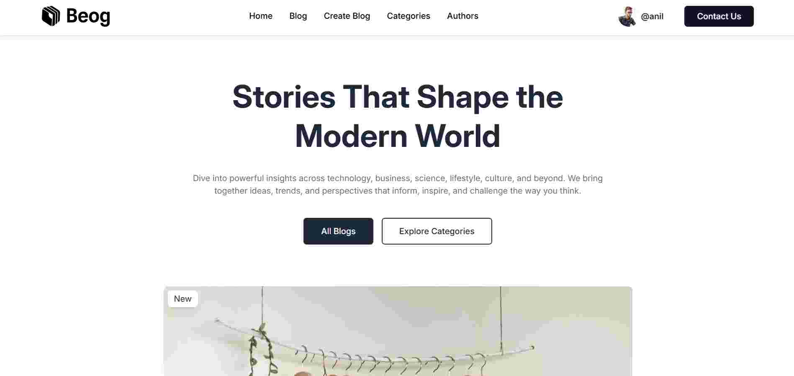
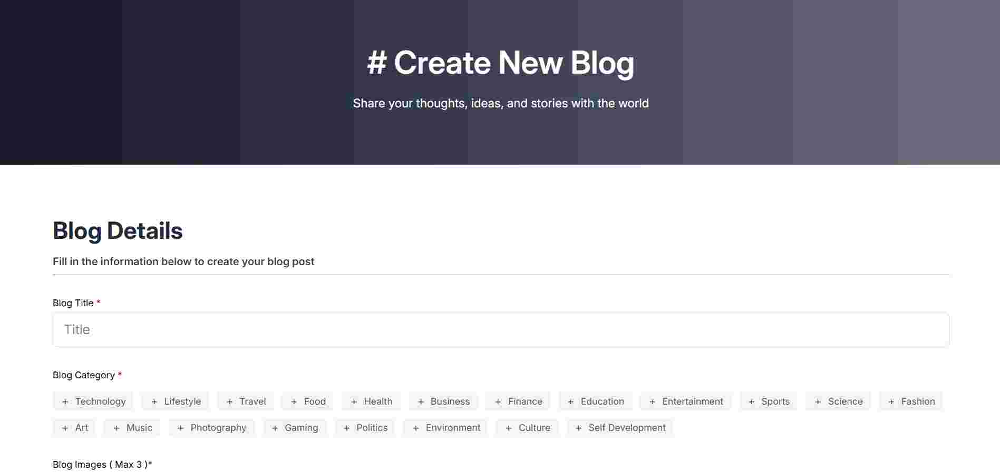
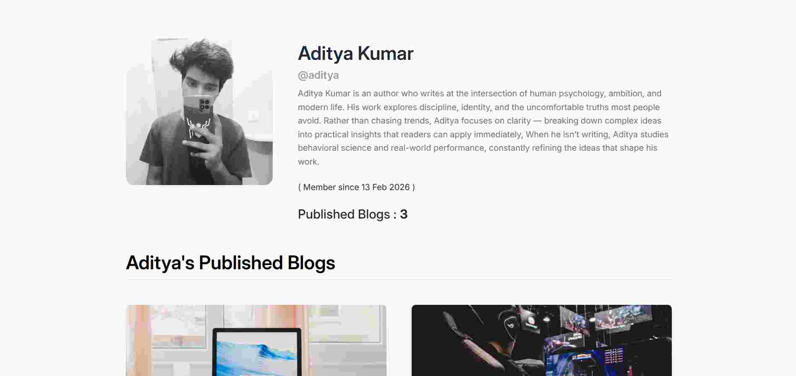
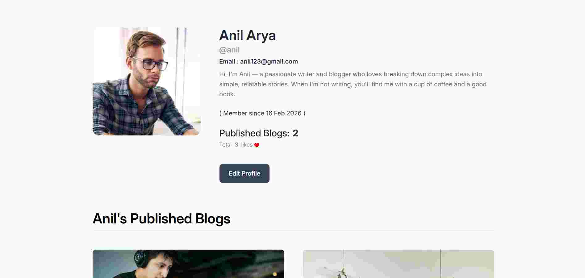

# BEOG

A full-stack MERN blogging platform where authenticated users can create, manage, categorize, and interact with blogs through likes, views, author profiles, and rich content editing.

Built using the MERN stack with JWT authentication, Redux Toolkit state management, MVC backend architecture, and responsive modern UI.

---

## Live Demo

https://mern-blog-app-mu-ecru.vercel.app/

---

## Screenshots

### Home Page


### Blog Details Page


### Create Blog Page


### Categories Page


### Author Profile


### User Profile


---

## Features

- JWT-based Authentication
- Create, Update, Delete Blogs
- Rich Text Blog Editor
- Multi-Image Blog Upload
- Blog Categories & Filtering
- Search Blogs Functionality
- Author System
- Dynamic Author Profiles
- Like & View System
- Responsive Design
- Profile Image Upload
- Protected Routes
- Skeleton Loading UI
- MVC Backend Architecture
- Frontend & Backend Data Sanitization
- Redux Toolkit State Management

---

## Blog System

### Categories

Users can assign multiple categories to blogs while publishing.  
Readers can filter blogs by category from the dedicated categories page.

### Author System

A user automatically becomes an author after publishing at least one blog.

- Authors appear on the Authors page
- Readers can visit author profiles
- Users can explore all blogs published by specific authors
- Users without published blogs are not displayed as authors

### Blog Interaction

Readers can:

- Like blogs
- Increase blog views by visiting blog pages
- Visit author profiles directly from blogs

---

## Tech Stack

### Frontend
- React.js
- Redux Toolkit
- Tailwind CSS
- Swiper.js
- PrimeReact Rich Text Editor
- Axios
- React Router DOM

### Backend
- Node.js
- Express.js

### Database
- MongoDB
- Mongoose

### Authentication
- JWT (JSON Web Token)

### Image Handling
- Multer

### Deployment
- Vercel (Frontend)
- Render (Backend)

---

## Folder Structure

```bash
BEOG/
│
├── frontend/
│   ├── public/
│   ├── src/
│   │   ├── assets/
│   │   ├── components/
│   │   ├── pages/
│   │   ├── redux/
│   │   ├── services/
│   │   └── utils/
│   ├── package.json
│   └── vite.config.js
│
├── backend/
│   ├── config/
│   ├── controller/
│   ├── middleware/
│   ├── model/
│   ├── public/
│   ├── routes/
│   ├── utils/
│   ├── validators/
│   ├── views/
│   ├── .env
│   ├── app.js
│   └── package.json
│
├── .gitignore
└── README.md
```

---

## What I Learned

This project helped me improve my understanding of:

- Advanced MERN application architecture
- File uploads using Multer
- Rich text editor integration
- Data sanitization techniques
- Relational data handling in MongoDB
- Dynamic filtering systems
- Full-stack deployment workflows

---

## Challenges Faced

- Managing multiple image uploads
- Structuring dynamic author systems
- Managing Redux state efficiently
- Optimizing loading states with skeleton UI

---

## Future Improvements

- Blog comments system
- Real-time notifications
- Bookmark blogs feature
- Follow authors functionality
- Draft & scheduled publishing
- Dark mode support
- SEO optimization
